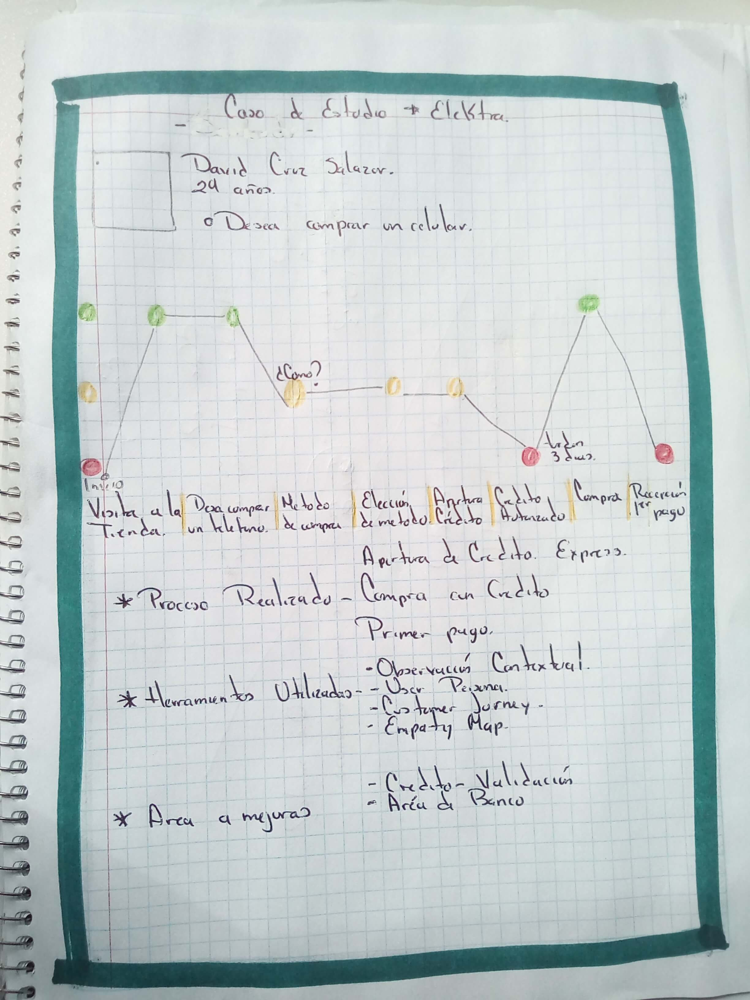
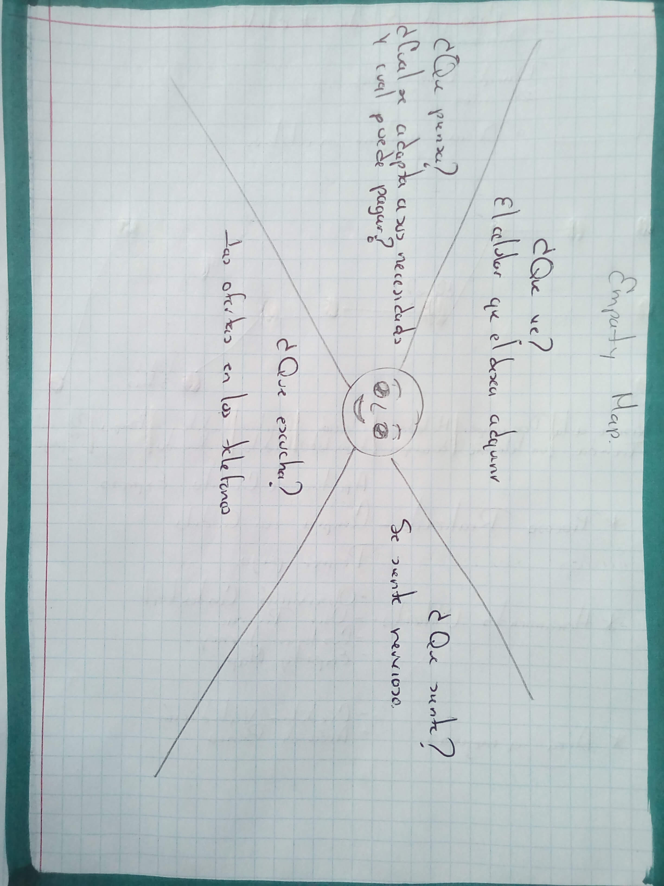
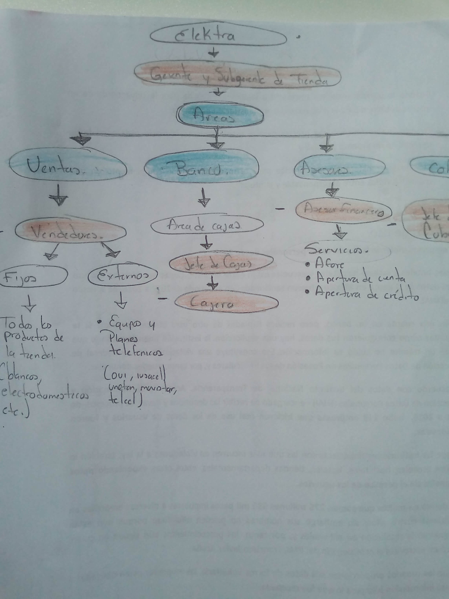
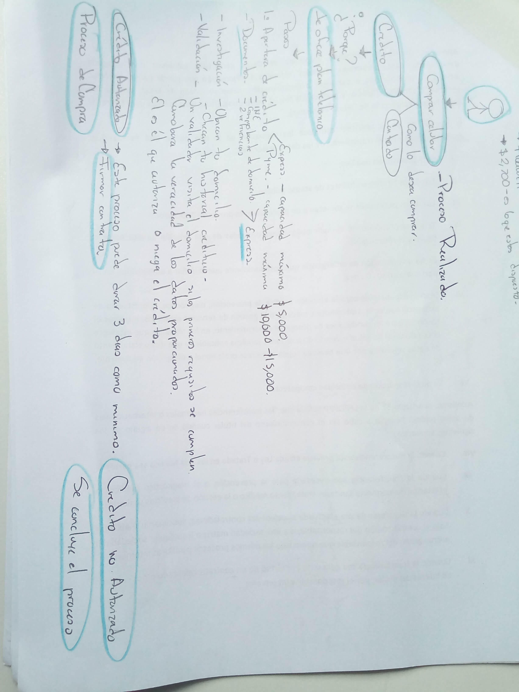
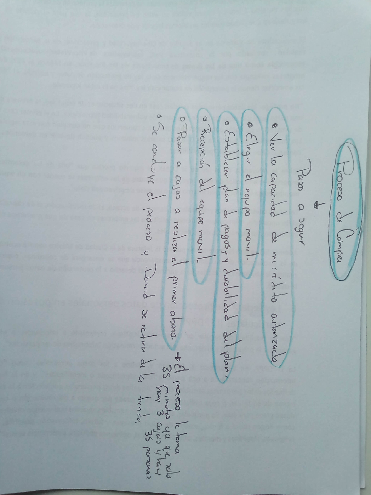
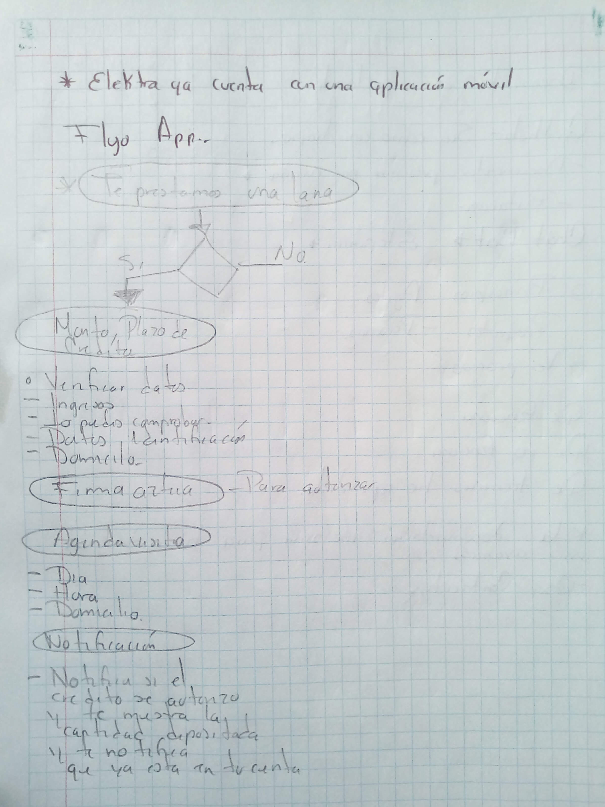

# SERVICE DESIGN
 ¿Que es el Service Design o Diseño de Servicio?

 La economía tradicional hace una clara distinción entre bienes y servicios.Service Design, una disciplina hacia la que debiera tender la experiencia de usuario .
 
 El diseño del servicio es la actividad de planear y organizar los recursos de una empresa (personas, accesorios y procesos) para (1) mejorar directamente la experiencia del empleado, y (2) indirectamente, la experiencia del cliente. 

 ## Historia del Diseño de Servicio

 El término "diseño de servicio" fue acuñado por Lynn Shostack en 1982. Shostack propuso que las organizaciones desarrollen un entendimiento de cómo los procesos detrás de escena interactúan entre sí porque "dejar los servicios al talento individual y administrar las piezas en lugar de hacer un todo". empresa más vulnerable y crea un servicio que reacciona lentamente a las necesidades y oportunidades del mercado ". 

## Componentes del 'Diseño del Servicio'

 Los tres componentes principales del diseño del servicio son:

**Gente** Este componente incluye a cualquier persona que crea o utiliza el servicio, así como a las personas que pueden verse afectadas indirectamente por el servicio. 

>>Ejemplos incluyen: 

- Empleados
- Clientes
- Compañeros clientes encontrados en todo el servicio
- Fogonadura 
**Accesorios** Este componente hace referencia a los artefactos físicos o digitales (incluidos los productos) que se necesitan para realizar el servicio con éxito. 

>>Ejemplos incluyen: 

- Espacio físico: escaparate, ventanilla, sala de conferencias.
- Entorno digital a través del cual se entrega el servicio.
- Páginas web
- Blogs
- Medios de comunicación social
- Objetos y colaterales.
- Archivos digitales
- Productos fisicos

**Procesos** Estos son los flujos de trabajo, procedimientos o rituales realizados por el empleado o el usuario a través de un servicio. 

>>Ejemplos incluyen: 

- Retirar dinero de un cajero automático
- Obtención de un problema resuelto sobre soporte
- Entrevistar a un nuevo empleado 
- Compartiendo un archivo
 
 # Ejercicio

 Elige un servicio que uses comunmente y detectes aréas de oportunidad.

En mi caso elegí Elektra ya que es banco que suelo usar constantemente ,pero en esta ocasion contare la experiencia de :
David  Cruz Salazar
El tiene 29 años  y desea comprar un telefono celular,pero no tiene suficiente dinero para pagarlo  de contado.
Entonces el decide ver que alternativas tiene: 
- La alternativa que le ofrece un asesor financiero es la apertura de un crédito en elektra.

## Proceso Realizado
Apertura de Crédito Express
Compra con crédito
Primer pago

## Herramientas Utilizadas 
Observación contextual
User Persona 
Customer Journey
Empaty Map

## Aréas a mejorar
Validación de crédito
Aréa de banco (cajas)

# Solución 

Elektra actualmente cuenta con una aplicación donde ademas de hacer transacciones bancarias le permite soiicitar un crédito eso agiliza el proceso ya que el usuario registra sus datos e indica en que momento pueden pasar a visitarlo.

Instalar la app(https://www.bancoazteca.com.mx/PortalBancoAzteca/baja-la-app.do)

 Fuente de consulta (http://www.torresburriel.com/weblog/2017/07/14/service-design-diseno-servicios/)
 (https://www.nngroup.com/articles/service-design-101/)